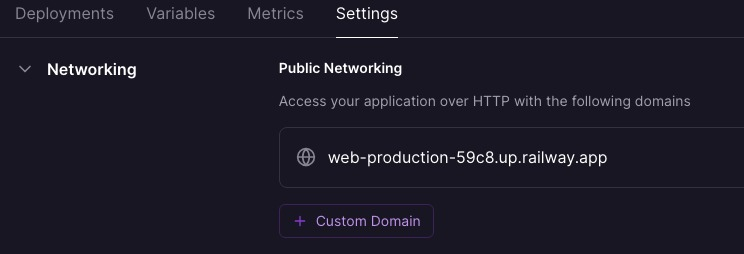
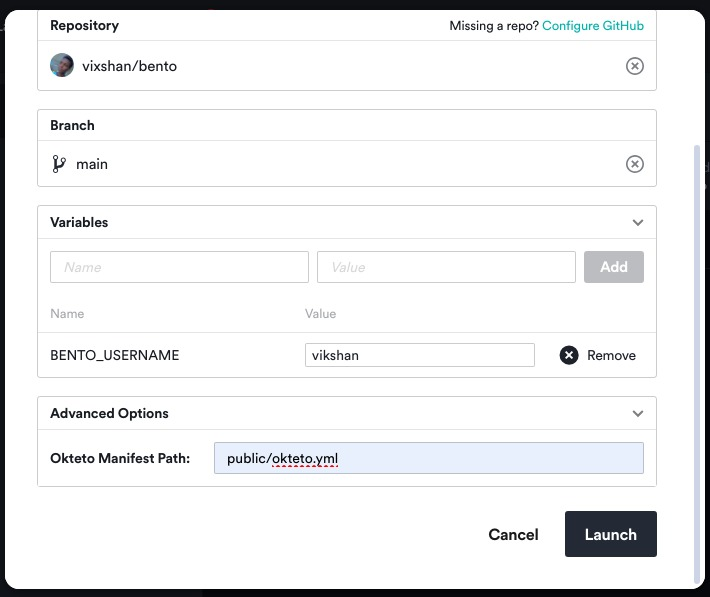

# Add a custom domain to your bento profile

## Prerequisites

##### Get free [$100 Credit](https://www.vultr.com/?ref=9556008-8H) on Vultr to try your app, available for a limited time only!

---

- A computer running Windows, Linux or macOS or a VPS running Ubuntu 20.04 or
  later, here are some of my recommendations, please note that these are
  affiliate links, I will get a small commission if you buy a VPS using these
  links.
  - Ionos - Click [here for a discount](https://acn.ionos.com/SHA5)
  - Vultr - Click here for
    [free $10 credit](https://www.vultr.com/?ref=9556007), or here for
    [free $100 Credit](https://www.vultr.com/?ref=9556008-8H)(limited time
    offer)
  - DigitalOcean - Click here for
    [free $200 credit](https://digitalocean.pxf.io/vikshan)
  - Hostinger - Click [here for a discount](https://hostinger.sjv.io/vikshan)
  - BigRock VPS - Click [here for a discount](https://bigrock-in.sjv.io/vikshan)
  - HostGator - Click
    [here for a discount](https://partners.hostgator.com/vikshan)

> If you don't know how to do this, I am an Ionos Partner and you can hire me at
> [Vikshan](https://partnernetwork.ionos.com/partner/vixshan)

- Node.js v20.0.0 or later
- npm v7.0.0 or later
- A [Bento](https://bento.me/vikshan) account
- A custom domain, I recommend [NameCheap](https://namecheap.pxf.io/vikshan) for
  this. Please note this is an affiliate link, I will get a small commission if
  you buy a domain using this link. Some of the VPS providers I mentioned above
  also sell domains. You can also use [Freenom](https://freenom.com) for a free
  domain.
- PM2 (optional)
- Apache2 (Required for VPS ) - I won't go deep on this, you can check a
  documentation I wrote for my Discord bot's dashboard
  [here](https://docs.vikshan.me/installation/dashboard/custom-domain), it is
  basically the same thing.
- Certbot (Required for SSL on VPS) see
  [here](https://docs.vikshan.me/installation/dashboard/custom-domain/ssl-certificate)

## Installation

### Instalation in a VPS or PC

1. Clone this repository and run `npm install` in the root directory

```bash
git clone https://github.com/vixshan/bento.git
cd bento
npm install
```

2. Create a `.env` file in the root directory and add the following variables,
   see `.env.example` for an example

```bash
BENTO_USERNAME=<your bento username>
```

3. Run `npm start` in the root directory

```bash
npm start
```

The app starts using PM2, you can now access your app at `http://localhost` or
`http://localhost:3000` if you're not using a reverse proxy.

To test your app, run `npm test` in the root directory

```bash
npm test
```

- Set up a reverse proxy to the app using Apache2 or Nginx. See
  [here](https://docs.vikshan.me/installation/dashboard/custom-domain) for
  Apache2 and
  [here](https://docs.nginx.com/nginx/admin-guide/web-server/reverse-proxy/) for
  Nginx.

### Deployment to Heroku

1. Give this repo a star and fork it to your GitHub account
   [here](https://github.com/vixshan/bento/fork).
2. if you do not have an Heroku account,create one
   [here](https://signup.heroku.com/).
3. Click
   [here to deploy](https://dashboard.heroku.com/new?template=https%3A%2F%2Fgithub.com%2Fvixshan%2Fbento)
   the app to Heroku

4. Now go to <b>Settings -> Domains</b> and add your custom domain.

<details>
  <summary>Adding a custom domain to your Heroku app</summary>
  
</details>
<br>

5. Now go to <b>Deploy -> Deployment method</b> and connect your app to the
   forked repo to enable auto deploys.

> Note: You can also deploy the app to Heroku using the Heroku CLI.

> Due to some issues, I think caching, deploying the app on Heroku doesnt show
> the images, They load for a brief second and disappear. So, I recommend
> deploying the app to a VPS or PC.

## DEPLOY TO RAILWAY

1. Give this repo a star and fork it to your GitHub account
   [here](https://github.com/vixshan/bento/fork).

2. If you do not have an Railway account,create one
   [here](https://railway.app/).

3. Now head towards https://railway.app/new, select Deploy from repo.
4. Now select the forked repository, select branch.
5. Now go to <b>Variables</b> and add variable listed below.
   - BENTO_USERNAME - Your bento username
6. Go to <b>Deployments</b> and wait for deplyment to complete.
7. Now go to <b>Settings -> Networking -> Custom Domain</b> and add your custom
   domain.

<details>
  <summary>Adding a custom domain to your Railway app</summary>
  
</details>

## DEPLOY TO OKTETO

1. Give this repo a star and fork it to your GitHub account
   [here](https://github.com/vixshan/bento/fork).

2. If You don't have an account On Okteto.
   [Create a account](https://www.okteto.com/pricing/?plan=SaaS).

3. Now head towards Lunch Dev Environment.
4. Now select the forked repository, select branch.
5. Now go to <b>Variables</b> and add variable listed below.
   - BENTO_USERNAME - Your bento username
6. Click on <b>Advanced Options </b> and add `public/okteto.yml` as your Okteto
   Manifest Path.
   <details>
     <summary>Launching your Okteto app</summary>
     
   </details>
7. To add your custom domain, see this
   [documentation](https://www.okteto.com/docs/cloud/custom-domains/).

## DEPLOY TO REPL.IT (FREE)

1. Give this repo a star and fork it to your GitHub account
   [here](https://github.com/vixshan/bento/fork).
2. If You don't have an account On Repl.it.
   [Create a account](https://repl.it/signup).
3. [](https://replit.com/github/vixshan/bento)
4. Now go to <b>Secrets</b> and add variable listed below.
   - BENTO_USERNAME - Your bento username
5. To add a custom domain, check this
   [documentation](https://docs.replit.com/hosting/custom-domains).

## DEPLOY TO KOYEB (RECOMMENDED, FREE)

1. Give this repo a star and fork it to your GitHub account
   [here](https://github.com/vixshan/bento/fork).
2. If You don't have an account On Koyeb.
   [Create a account](https://app.koyeb.com/signup).
3. Now head towards
   [Create an app](https://app.koyeb.com/apps/new/import-project), select Deploy
   from GitHub.
4. Now select the forked repository, select branch.
   
5. Now go to <b>Variables</b> and add variable listed below.

   - BENTO_USERNAME - Your bento username
     > by default it launches with the .env file, so i case of conflicts, remove
     > the `.env` file and add the variables in the Koyeb dashboard.

   <br>

> please note Custom domanis are not supported in KOYAB HOBBY plan, you have to
> upgrade to a paid plan to add a custom domain.

## Usage

I haven't tried deploying the app to other platforms like AWS, CloudFlare
Workers, etc. If you have, please let me know how it went. My instance is
deployed on Azure, and cached by CloudFlare.

- Cached - [vikshan.me](https://vikshan.me)
- Uncached -
  [bento.eastus.cloudapp.azure.com](https://bento.eastus.cloudapp.azure.com/)

## Contributing

I am not a professional developer, I am still learning. If you find any bugs or
issues with the app please open an issue or a pull request. I will be happy to
review it. Also if you have any suggestions or ideas, please let me know.

If this project helped you, please consider giving it a star ⭐, or sponsor me
[here](https://github.com/sponsors/vixshan) and check out my other projects
[here](https://github.com/vixshan?tab=repositories) It will help me a lot.

## License

This project is licensed under the MIT License - see the [LICENSE](LICENSE) file
for details

## Powered by;

[](https://www.digitalocean.com/?refcode=c5587212fe39&utm_campaign=Referral_Invite&utm_medium=Referral_Program&utm_source=badge)
<a href="https://www.vultr.com/?ref=9556008-8H"></a>
